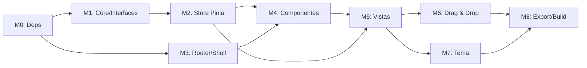

# PLAN.md — Hoja de Ruta de Construcción

> **Proyecto:** Gestor de Metas Financieras  
> **Base:** Ionic 8 + Vue 3 + Pinia + TypeScript strict  
> **Agente:** Lee `AGENT.md` antes de comenzar cualquier Milestone.  
> **Convención de estado:** ✅ Completo · 🔄 En progreso · ⬜ Pendiente

---

## MILESTONE 0 — Instalación de Dependencias
**Estado:** ⬜  
**Toca archivos:** `package.json`, `src/main.ts`

### Paso 0.1 — Instalar paquetes necesarios
```bash
pnpm add pinia @capacitor/preferences vuedraggable sortablejs
pnpm add -D @types/sortablejs
```

### Paso 0.2 — Registrar Pinia en `src/main.ts`
- Importar `createPinia` de `pinia`.
- Añadir `.use(createPinia())` **antes** de `.use(router)`.
- No eliminar ninguna línea existente.

### Paso 0.3 — Inicializar `@capacitor/preferences`
- Verificar que `capacitor.config.ts` tiene `appId` correcto (`com.metas.financieras`).
- Si no, actualizar `appId` y `appName`.

### Criterio de éxito
`pnpm dev` arranca sin errores TypeScript. `pnpm build` compila limpio.

---

## MILESTONE 1 — Core: Interfaces y Adaptador de Storage
**Estado:** ⬜  
**Toca archivos:**
- `src/core/interfaces/models.ts` ← CREAR
- `src/core/db/storage.ts` ← CREAR

### Paso 1.1 — Interfaces (`src/core/interfaces/models.ts`)
Copiar **exactamente** el bloque de interfaces de `AGENT.md §3`. Nada más en este archivo.

### Paso 1.2 — Adaptador de Storage (`src/core/db/storage.ts`)
Implementar las 4 funciones del contrato definido en `AGENT.md §5`.

```typescript
// src/core/db/storage.ts
import { Preferences } from '@capacitor/preferences'

export async function storageGet<T>(key: string): Promise<T | null> {
  try {
    const { value } = await Preferences.get({ key })
    return value ? (JSON.parse(value) as T) : null
  } catch {
    return null
  }
}

export async function storageSet<T>(key: string, value: T): Promise<void> {
  await Preferences.set({ key, value: JSON.stringify(value) })
}

export async function storageRemove(key: string): Promise<void> {
  await Preferences.remove({ key })
}

export async function storageClear(): Promise<void> {
  await Preferences.clear()
}
```

### Paso 1.3 — Utilidad JSON I/O (`src/core/utils/json-io.ts`)
Dos funciones puras (sin efectos secundarios):
```typescript
// Recibe array de proyectos, retorna string JSON del ExportSnapshot
export function serializarSnapshot(proyectos: Proyecto[]): string

// Recibe string JSON, valida versión, retorna array de proyectos o lanza Error
export function deserializarSnapshot(json: string): Proyecto[]
```

### Criterio de éxito
`vue-tsc --noEmit` sin errores. Los tipos son importables desde cualquier otro módulo.

---

## MILESTONE 2 — Store de Pinia (Lógica de Negocio Completa)
**Estado:** ⬜  
**Toca archivos:**
- `src/stores/proyectos.store.ts` ← CREAR

### Paso 2.1 — Esqueleto del Store
```typescript
// src/stores/proyectos.store.ts
import { defineStore } from 'pinia'
import { ref, computed } from 'vue'
// imports de interfaces, storage, json-io
```

### Paso 2.2 — `cargarProyectos`
- Clave de storage: `'proyectos_v1'`.
- Al arrancar la app, el store llama a esta acción automáticamente vía `onMounted` en `App.vue` (una sola vez).

### Paso 2.3 — CRUD de Proyectos e Ítems
Implementar las 7 acciones del contrato en `AGENT.md §4`.

Reglas de implementación:
- `guardarProyecto`: si `proyectos.value.findIndex(p => p.id === proyecto.id) >= 0` → reemplazar, si no → push.
- `guardarItem`: busca el proyecto por id, luego aplica el mismo patrón upsert en `proyecto.items`.
- Toda mutación debe ejecutar `await storageSet('proyectos_v1', proyectos.value)` antes de retornar.

### Paso 2.4 — Computed `progresoDeProyecto`
```typescript
const progresoDeProyecto = computed(() => (proyectoId: string): ProgresoProyecto => {
  const proyecto = proyectos.value.find(p => p.id === proyectoId)
  if (!proyecto) return { costoMinimo: 0, costoIdeal: 0, porcentajeMinimo: 0, porcentajeIdeal: 0 }

  const itemsPendientes = proyecto.items.filter(i => !i.yaLoTenemos && i.estado !== EstadoItem.Logrado)

  const costoMinimo = itemsPendientes
    .filter(i => i.tipo === TipoItem.Obligatorio)
    .reduce((sum, i) => sum + i.presupuestoGama[i.gamaSeleccionada], 0)

  const costoIdeal = itemsPendientes
    .reduce((sum, i) => sum + i.presupuestoGama[i.gamaSeleccionada], 0)

  return {
    costoMinimo,
    costoIdeal,
    porcentajeMinimo: costoMinimo > 0 ? Math.min(100, (proyecto.ahorroActual / costoMinimo) * 100) : 100,
    porcentajeIdeal:  costoIdeal  > 0 ? Math.min(100, (proyecto.ahorroActual / costoIdeal)  * 100) : 100,
  }
})
```

### Paso 2.5 — `exportarJSON` / `importarJSON`
- `exportarJSON`: llama `serializarSnapshot(proyectos.value)` y retorna el string.
- `importarJSON`: llama `deserializarSnapshot(jsonStr)`, confirma con un `ion-alert` en la vista que lo invoca, luego reemplaza el array y persiste.

### Criterio de éxito
Tests unitarios (vitest) para `progresoDeProyecto` con datos mockeados pasan al 100%.

---

## MILESTONE 3 — Enrutamiento y Shell
**Estado:** ⬜  
**Toca archivos:**
- `src/router/index.ts` ← MODIFICAR
- `src/App.vue` ← MODIFICAR

### Paso 3.1 — Rutas
```typescript
{ path: '/',           component: () => import('@/views/HomePage.vue') },
{ path: '/proyecto/:id', component: () => import('@/views/ProyectoDetalle.vue'), props: true },
```

### Paso 3.2 — `App.vue`
- Añadir `onMounted(() => store.cargarProyectos())`.
- Mantener `<ion-app><ion-router-outlet /></ion-app>`.

---

## MILESTONE 4 — Componentes Atómicos
**Estado:** ⬜  
**Toca archivos:** Todos los archivos en `src/components/`

### Orden de construcción (de menor a mayor complejidad)

#### 4.1 `BarraProgreso.vue`
**Props:**
```typescript
defineProps<{
  porcentaje: number   // 0-100
  etiqueta: string     // 'Meta Mínima' | 'Meta Ideal'
  color: string        // 'success' | 'warning' | 'danger'
}>()
```
Usa `ion-progress-bar` con `:value="porcentaje / 100"`.  
Muestra porcentaje formateado con `toFixed(1)`.

#### 4.2 `GamaSelector.vue`
**Props:** `{ gamaActual: Gama, proyectoId: string, itemId: string }`  
**Emits:** `update:gama(gama: Gama)`  
Renderiza `ion-segment` con un `ion-segment-button` por cada valor del enum `Gama`.

#### 4.3 `ItemCard.vue`
**Props:** `{ item: ItemRequerido, proyectoId: string }`  
**Emits:** `edit`, `delete`  
Muestra: nombre, `ion-badge` de prioridad, `ion-badge` de tipo, checkbox `yaLoTenemos`, costo calculado con la gama seleccionada, `GamaSelector` embebido.  
Colores de badge: Alta=danger, Media=warning, Baja=success · Obligatorio=primary, Extra=secondary.

#### 4.4 `ProyectoCard.vue`
**Props:** `{ proyecto: Proyecto, progreso: ProgresoProyecto }`  
Muestra: nombre, descripción, ahorro actual, dos `BarraProgreso` (mínima e ideal), botón "Ver Ítems" con `router-link`.

#### 4.5 `ItemModal.vue`
`ion-modal` con formulario para crear/editar `ItemRequerido`.  
**Props:** `{ proyectoId: string, item?: ItemRequerido }`  
**Emits:** `saved(item: ItemRequerido)`, `dismissed`  
Campos: nombre, prioridad (ion-select), tipo (ion-select), estado (ion-select), yaLoTenemos (ion-toggle), notas (ion-textarea), presupuesto por cada gama (5 ion-input numéricos).  
Al guardar llama `store.guardarItem(proyectoId, nuevoItem)` y emite `saved`.

#### 4.6 `ProyectoModal.vue`
`ion-modal` para crear/editar `Proyecto`.  
**Props:** `{ proyecto?: Proyecto }`  
Campos: nombre, descripción, moneda, ahorro actual, gama global.

### Criterio de éxito
Cada componente renderiza sin errores. Props y emits tienen tipos explícitos.

---

## MILESTONE 5 — Vistas Principales
**Estado:** ⬜  
**Toca archivos:**
- `src/views/HomePage.vue` ← CREAR
- `src/views/ProyectoDetalle.vue` ← CREAR

### 5.1 `HomePage.vue`
- Usa `ion-page > ion-header + ion-content`.
- Lista de `ProyectoCard` con `v-for`.
- FAB (`ion-fab`) en esquina inferior derecha para crear proyecto → abre `ProyectoModal`.
- Botones de acción en toolbar: Exportar JSON (`store.exportarJSON()` → `Filesystem.writeFile` o `share`) e Importar JSON (input file).
- El `progresoDeProyecto` de cada card se obtiene como `store.progresoDeProyecto(p.id)`.

### 5.2 `ProyectoDetalle.vue`
**Props:** `{ id: string }` (inyectado por el router)

#### Lógica de layout adaptativo:
```typescript
import { isPlatform } from '@ionic/vue'
const esMobile = computed(() => isPlatform('mobile'))
```

**Si `esMobile`** → Renderizar `ion-tabs`:
```
Tab 1: Backlog     (filtra items por EstadoItem.Backlog)
Tab 2: En Proceso  (filtra items por EstadoItem.EnProceso)
Tab 3: Logrado     (filtra items por EstadoItem.Logrado)
```
Cada tab contiene una lista de `ItemCard`. En long-press sobre un card, muestra `ion-action-sheet` con opciones de cambio de estado.

**Si `!esMobile`** → Renderizar tres columnas Kanban con `ion-grid`:
```
ion-col (Backlog) | ion-col (En Proceso) | ion-col (Logrado)
```
Cada columna envuelve sus `ItemCard` en un componente `<draggable>` de vuedraggable.

### Criterio de éxito
Navegar entre Home y Detalle funciona. Layout cambia correctamente según plataforma.

---

## MILESTONE 6 — Drag & Drop
**Estado:** ⬜  
**Toca archivos:**
- `src/composables/useDragDrop.ts` ← CREAR
- `src/views/ProyectoDetalle.vue` ← MODIFICAR

### Paso 6.1 — Composable `useDragDrop.ts`
```typescript
import type { SortableEvent } from 'sortablejs'
import { useProyectosStore } from '@/stores/proyectos.store'
import { EstadoItem } from '@/core/interfaces/models'

export function useDragDrop(proyectoId: string) {
  const store = useProyectosStore()

  function onDrop(event: SortableEvent, nuevoEstado: EstadoItem): void {
    const itemId = event.item.dataset['itemId']
    if (!itemId) return
    store.moverItem(proyectoId, itemId, nuevoEstado)
  }

  return { onDrop }
}
```

### Paso 6.2 — Integrar en `ProyectoDetalle.vue` (rama desktop)
Cada columna Kanban usa `<draggable>`:
```html
<draggable
  :list="itemsPorEstado[EstadoItem.Backlog]"
  group="items"
  item-key="id"
  @end="(e) => onDrop(e, EstadoItem.Backlog)"
>
  <template #item="{ element }">
    <ItemCard :item="element" :proyecto-id="id" />
  </template>
</draggable>
```

> **Regla crítica:** `list` es una copia derivada (computed). La fuente de verdad siempre es el store.

### Paso 6.3 — Alternativa Mobile (Action Sheet)
```typescript
// En ItemCard.vue o ProyectoDetalle.vue (tab view)
async function cambiarEstado(item: ItemRequerido): Promise<void> {
  const actionSheet = await actionSheetController.create({
    header: 'Mover ítem a…',
    buttons: Object.values(EstadoItem)
      .filter(e => e !== item.estado)
      .map(e => ({
        text: e,
        handler: () => store.moverItem(proyectoId, item.id, e),
      })),
  })
  await actionSheet.present()
}
```

### Criterio de éxito
Arrastrar un ítem entre columnas en desktop actualiza el store y persiste. En mobile, el action sheet cambia el estado correctamente.

---

## MILESTONE 7 — Tema Visual y Pulido
**Estado:** ⬜  
**Toca archivos:**
- `src/theme/variables.css` ← MODIFICAR
- `src/components/*.vue` ← repasar estilos

### Paso 7.1 — Tokens de diseño en `variables.css`
Definir al menos:
- Color primario: azul índigo profundo `#4F46E5` 
- Color de éxito (logrado): verde esmeralda `#10B981`
- Color de advertencia (en proceso): ámbar `#F59E0B`
- Dark mode: fondo `#0F172A`, superficie `#1E293B`
- Tipografía: Google Font "Inter" vía `@import` en `index.html`

### Paso 7.2 — Animaciones
- `ItemCard`: `transition: transform 0.15s ease` en hover (web).
- `BarraProgreso`: `ion-progress-bar` con transición suave al recalcular.
- `ProyectoCard`: sombra sutil elevada en hover.

### Paso 7.3 — Accesibilidad
- Todos los `ion-input` tienen `aria-label` descriptivo.
- Contraste mínimo AA en badges de color.

### Criterio de éxito
App se ve profesional en modo claro y oscuro. Sin Lighthouse issues de contraste.

---

## MILESTONE 8 — Exportación / Importación y Build Final
**Estado:** ⬜  
**Toca archivos:**
- `src/views/HomePage.vue` ← MODIFICAR (botones de I/O)
- `capacitor.config.ts` ← verificar

### Paso 8.1 — Exportar JSON
```typescript
async function exportar(): Promise<void> {
  const json = await store.exportarJSON()
  const blob = new Blob([json], { type: 'application/json' })
  const url = URL.createObjectURL(blob)
  const a = document.createElement('a')
  a.href = url
  a.download = `metas-backup-${new Date().toISOString().slice(0,10)}.json`
  a.click()
  URL.revokeObjectURL(url)
}
```
En Android nativo, usar `@capacitor/filesystem` + `@capacitor/share` en su lugar.

### Paso 8.2 — Importar JSON
```typescript
async function importar(event: Event): Promise<void> {
  const file = (event.target as HTMLInputElement).files?.[0]
  if (!file) return
  const text = await file.text()
  await store.importarJSON(text) // validación interna en deserializarSnapshot
}
```

### Paso 8.3 — Build y Sync Capacitor
```bash
pnpm build
npx cap sync android
npx cap open android   # opcional, para revisar en Android Studio
```

### Criterio de éxito
El archivo `.json` exportado puede reimportarse sin pérdida de datos. La app Android muestra el mismo comportamiento que la web.

---

## RESUMEN DE DEPENDENCIAS POR MILESTONE



---

## REFERENCIA RÁPIDA DE ARCHIVOS

| Archivo | Milestone | Propósito |
|---------|-----------|-----------|
| `src/core/interfaces/models.ts` | M1 | Tipos TS únicos |
| `src/core/db/storage.ts` | M1 | Adaptador de persistencia |
| `src/core/utils/json-io.ts` | M1 | Serialización pura |
| `src/stores/proyectos.store.ts` | M2 | TODA la lógica de negocio |
| `src/router/index.ts` | M3 | Rutas |
| `src/components/BarraProgreso.vue` | M4 | Progreso visual |
| `src/components/GamaSelector.vue` | M4 | Selector de gama |
| `src/components/ItemCard.vue` | M4 | Card de ítem |
| `src/components/ProyectoCard.vue` | M4 | Card de proyecto |
| `src/components/ItemModal.vue` | M4 | Formulario ítem |
| `src/components/ProyectoModal.vue` | M4 | Formulario proyecto |
| `src/views/HomePage.vue` | M5 | Lista de proyectos |
| `src/views/ProyectoDetalle.vue` | M5+M6 | Kanban/Tabs adaptativo |
| `src/composables/useDragDrop.ts` | M6 | Bridge D&D ↔ Pinia |
| `src/theme/variables.css` | M7 | Tokens visuales |
